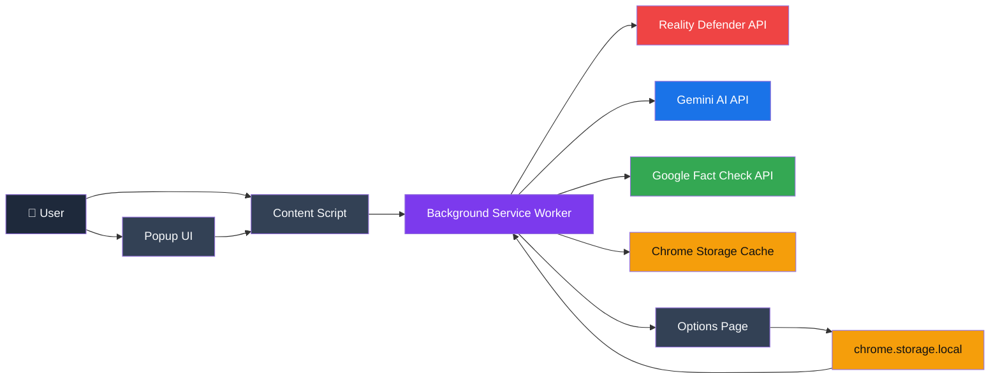
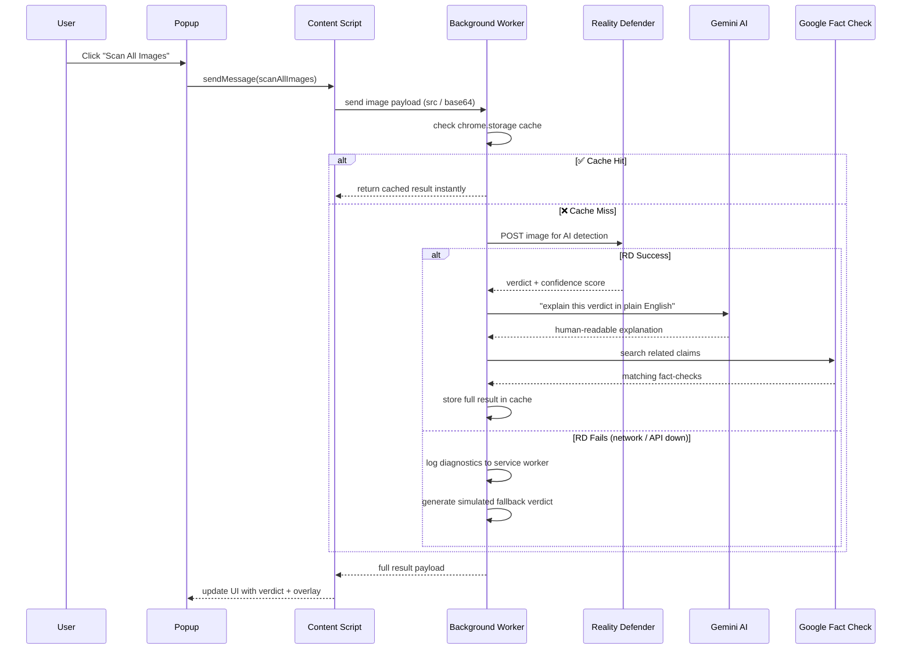
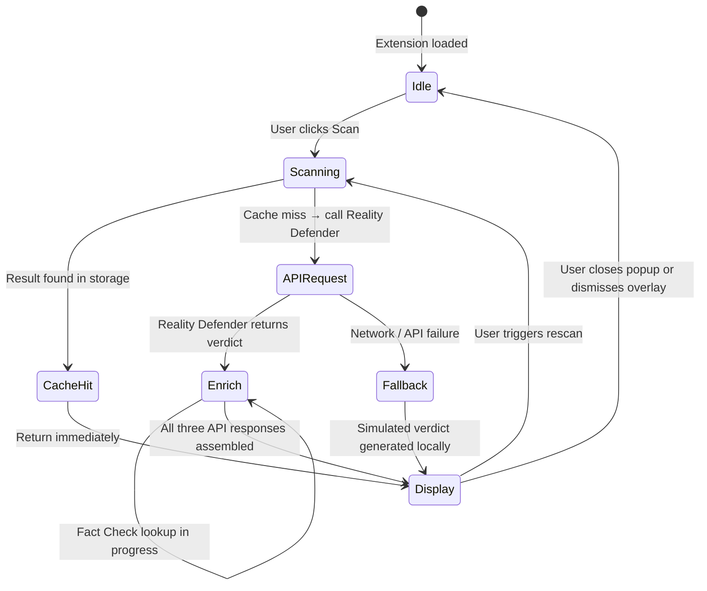
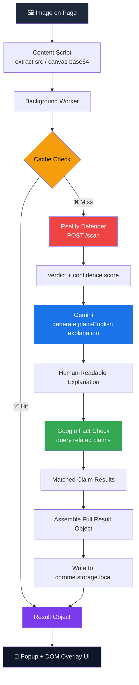

<div align="center">

<!-- ═══════════════════════════════════════════════════════════════ -->
<!--                        HERO BLOCK                              -->
<!-- ═══════════════════════════════════════════════════════════════ -->

<a href="https://pixelproof.dualmindlab.tech">
  
</a>

<br/><br/>

<h3>See Through the Lie — AI Image Detection, Right in Your Browser</h3>

<p>
  A <strong>Chrome extension</strong> that detects AI-generated and manipulated images in real time,<br/>
  explains every finding in plain English, and cross-checks claims against live fact-check data.<br/>
  <em>Built for Next Byte Hacks V2 by <strong>Harsh Bhanushali</strong>.</em>
</p>

<br/>

<a href="https://pixelproof.dualmindlab.tech">
  
</a>
&nbsp;
<a href="https://pixelproof.dualmindlab.tech/#demo">
  
</a>
&nbsp;
<a href="https://devpost.com/software/pixelproof-l5ofpx">
  
</a>

<br/><br/>

<!-- SECONDARY BADGES -->


<br/><br/>

<!-- POWERED BY -->


<br/><br/>

<!-- QUICK LINKS -->
<strong>
  <a href="https://pixelproof.dualmindlab.tech">🏠 Landing Page</a>
  &nbsp;·&nbsp;
  <a href="https://pixelproof.dualmindlab.tech/#demo">🎬 Live Demo</a>
  &nbsp;·&nbsp;
  <a href="https://devpost.com/software/pixelproof-l5ofpx">🏆 Devpost</a>
  &nbsp;·&nbsp;
  <a href="#-quick-start">🚀 Quick Start</a>
  &nbsp;·&nbsp;
  <a href="#-roadmap">🗺️ Roadmap</a>
  &nbsp;·&nbsp;
  <a href="#-faq--troubleshooting">❓ FAQ</a>
  &nbsp;·&nbsp;
  <a href="#-contributing">🤝 Contribute</a>
</strong>

</div>

---

<!-- ═══════════════════════════════════════════════════════════════ -->
<!--                    TABLE OF CONTENTS                           -->
<!-- ═══════════════════════════════════════════════════════════════ -->

## 📋 Table of Contents

| # | Section |
|---|---------|
| 1 | [🌐 Live Demo & Landing Page](#-live-demo--landing-page) |
| 2 | [🔍 The Problem We're Solving](#-the-problem-were-solving) |
| 3 | [✨ Feature Overview](#-feature-overview) |
| 4 | [🖥️ Browser Support](#️-browser-support) |
| 5 | [🏗️ Architecture — System Overview](#️-architecture) |
| 6 | [🔄 How a Scan Works](#-how-a-scan-works) |
| 7 | [⚙️ State Machine](#️-state-machine) |
| 8 | [📊 Data Flow](#-data-flow) |
| 9 | [📁 Project Structure](#-project-structure) |
| 10 | [🔧 Tech Stack](#-tech-stack) |
| 11 | [🚀 Quick Start](#-quick-start) |
| 12 | [🔑 API Key Setup](#-api-key-setup) |
| 13 | [🎬 Demo Walkthrough](#-demo-walkthrough) |
| 14 | [💻 Usage Examples](#-usage-examples) |
| 15 | [⚡ Performance](#-performance) |
| 16 | [🛡️ Fallback Mode](#️-fallback-mode) |
| 17 | [🗺️ Roadmap](#️-roadmap) |
| 18 | [🧪 Testing](#-testing) |
| 19 | [❓ FAQ & Troubleshooting](#-faq--troubleshooting) |
| 20 | [🔒 Security](#-security) |
| 21 | [⚠️ Known Limitations](#️-known-limitations) |
| 22 | [🤝 Contributing](#-contributing) |
| 23 | [📝 Changelog](#-changelog) |
| 24 | [🙏 Acknowledgements](#-acknowledgements) |
| 25 | [👤 Author](#-author) |
| 26 | [📄 License](#-license) |

---

<!-- ═══════════════════════════════════════════════════════════════ -->
<!--                  LIVE DEMO & LANDING PAGE                      -->
<!-- ═══════════════════════════════════════════════════════════════ -->

## 🌐 Live Demo & Landing Page

<div align="center">

| | Link | Description |
|---|---|---|
| 🏠 | **[pixelproof.dualmindlab.tech](https://pixelproof.dualmindlab.tech)** | Full landing page — overview, features, screenshots |
| 🎬 | **[pixelproof.dualmindlab.tech/#demo](https://pixelproof.dualmindlab.tech/#demo)** | Interactive demo — no API keys required |
| 🏆 | **[devpost.com/software/pixelproof-l5ofpx](https://devpost.com/software/pixelproof-l5ofpx)** | Hackathon submission page — Next Byte Hacks V2 |

</div>

> **Note — Demo runs in Fallback Mode by default.** You will see the complete detection flow — overlays, confidence scores, plain-English explanations, and the verdict panel — without needing any API key. To enable live AI detection, install the extension locally and add your own keys (see [API Key Setup](#-api-key-setup)).

---

<!-- ═══════════════════════════════════════════════════════════════ -->
<!--                      THE PROBLEM                               -->
<!-- ═══════════════════════════════════════════════════════════════ -->

## 🔍 The Problem We're Solving

> **The internet is drowning in AI-generated images, deepfakes, and manipulated media — and most people have no way to tell.**

In 2024, AI-generated images spread as "real" news across every major platform. Synthetic faces passed as real people. Fabricated war footage shaped public opinion. Deepfaked politicians went viral before corrections could catch up. The average user scrolling their feed has zero tools to push back — in the moment, in context, without leaving the page.

**Existing solutions ask users to copy a URL into a third-party tool.** By then, the damage is done.

PixelProof takes a different approach:

```
❌  Old way:  See image → feel unsure → maybe Google it → probably forget it
✅  PixelProof:  See image → scan in 1 click → instant verdict + explanation → right there
```

It lives in your browser. It works on every page. It catches fakes while you scroll.

---

<!-- ═══════════════════════════════════════════════════════════════ -->
<!--                     FEATURE OVERVIEW                           -->
<!-- ═══════════════════════════════════════════════════════════════ -->

## ✨ Feature Overview

<div align="center">

| Feature | What It Does | Why It Matters |
|---|---|---|
| 🖼️ **Live Image Scanning** | Detects AI-generated or manipulated images on any webpage without leaving the tab | No context switching — detection happens where the content is |
| 🤖 **AI-Powered Explanation** | Google Gemini translates raw detection output into plain English | Non-technical users can understand and act on the verdict |
| 📰 **Fact-Check Lookup** | Cross-references image claims against Google's Fact Check database | Surfaces existing debunks automatically |
| ⚡ **Smart Caching** | Results stored in `chrome.storage.local` — rescans return instantly | Zero duplicate API calls; instant UX on repeat visits |
| 🛡️ **Graceful Fallback** | Works even when all APIs are down — UI never breaks | Demo-safe; field-reliable |
| 🔑 **Local Key Storage** | API keys live in `chrome.storage.local` only | Keys never leave your machine, never touch any server |
| 🎯 **Bulk Scanning** | Scan all images on a page in a single click | Efficient for news pages, social feeds, image galleries |
| 🎨 **DOM Overlays** | Visual confidence badges appear directly over each scanned image | At-a-glance trust signals without opening any panel |
| 📊 **Slide-In Panel** | Detailed verdict, Gemini explanation, and fact-check results in one place | Full context without disrupting the page layout |

</div>

---

<!-- ═══════════════════════════════════════════════════════════════ -->
<!--                    BROWSER SUPPORT                             -->
<!-- ═══════════════════════════════════════════════════════════════ -->

## 🖥️ Browser Support

<div align="center">

| Browser | Minimum Version | Platform | Status |
|---|---|---|---|
|  | 109+ | Desktop | ✅ Fully supported |
|  | 109+ | Desktop | ✅ Fully supported |
|  | — | — | ❌ Not supported (MV3 API incompatibility) |
|  | — | — | ❌ Not supported (WebExtensions divergence) |
|  | — | Mobile | ⚠️ Chrome extensions not supported on mobile |

</div>

> DevTools recommended for the full demo experience (service worker console, storage inspection).

---

<!-- ═══════════════════════════════════════════════════════════════ -->
<!--         ARCHITECTURE — DIAGRAM THEN EXPLANATION                -->
<!-- ═══════════════════════════════════════════════════════════════ -->

## 🏗️ Architecture

PixelProof is built on a **4-layer pipeline** inside Chrome's Manifest V3 architecture. Each layer has a single responsibility, communicates over Chrome's native messaging bus, and can fail independently without taking down the rest of the system.

```
User Action  ──▶  Content Script  ──▶  Background Worker  ──▶  External APIs
                                              ↕
                                   Chrome Storage Cache
```

### System Overview

The diagram below shows all components and how they connect:



**Component responsibilities:**

| Component | Role |
|---|---|
| **Popup UI** | Extension dashboard — triggers scans, renders results, opens settings |
| **Content Script** | Runs on every page — discovers images, injects DOM overlays, relays messages |
| **Background Service Worker** | Orchestrates the full scan pipeline, manages the cache, handles API calls |
| **Chrome Storage Cache** | Persists scan results per image URL — eliminates duplicate API requests |
| **Options Page** | Lets users save API keys securely to `chrome.storage.local` |
| **Reality Defender API** | Classifies each image as real, AI-generated, or manipulated with a confidence score |
| **Gemini AI API** | Converts the raw detection verdict into a plain-English explanation |
| **Google Fact Check API** | Queries a live fact-check database for claims related to the image |

---

<!-- ═══════════════════════════════════════════════════════════════ -->
<!--         HOW A SCAN WORKS — DIAGRAM THEN EXPLANATION            -->
<!-- ═══════════════════════════════════════════════════════════════ -->

## 🔄 How a Scan Works

The scan sequence diagram shows the exact message flow from the moment a user clicks **Scan** to the moment the verdict appears on screen:



**Step-by-step breakdown:**

1. **User clicks Scan** — the popup sends a message to the content script running on the active tab.
2. **Content script collects images** — it discovers all `` elements (and canvas-derived base64 payloads) and forwards them to the background worker.
3. **Background worker checks the cache** — if a result already exists for that image URL, it returns immediately. No API call needed.
4. **Reality Defender call** — on a cache miss, the image is POSTed to Reality Defender's detection endpoint. The response includes a verdict label and a confidence percentage.
5. **Gemini enrichment** — the raw verdict is sent to Gemini with a prompt to produce a human-readable explanation suited to a non-technical audience.
6. **Fact-Check lookup** — the background worker queries Google's Fact Check API for any claims that match the image context.
7. **Result assembly & cache write** — all three API responses are merged into a single result object and written to `chrome.storage.local`.
8. **UI update** — the content script receives the result and renders a confidence overlay on the image; the popup renders the full verdict panel.

---

<!-- ═══════════════════════════════════════════════════════════════ -->
<!--         STATE MACHINE — DIAGRAM THEN EXPLANATION               -->
<!-- ═══════════════════════════════════════════════════════════════ -->

## ⚙️ State Machine

Each image scan moves through a well-defined set of states. The diagram shows every valid transition:



**State definitions:**

| State | Description |
|---|---|
| **Idle** | Extension is loaded and waiting. No scan in progress. |
| **Scanning** | Image payload received; cache lookup underway. |
| **CacheHit** | A valid cached result was found. Display immediately — no API call. |
| **APIRequest** | Cache miss; Reality Defender detection request is in flight. |
| **Enrich** | Verdict received; Gemini and Fact Check requests are in flight in parallel. |
| **Fallback** | One or more API calls failed; simulated verdict generated locally. |
| **Display** | Final result (live or fallback) rendered in the overlay and verdict panel. |

---

<!-- ═══════════════════════════════════════════════════════════════ -->
<!--         DATA FLOW — DIAGRAM THEN EXPLANATION                   -->
<!-- ═══════════════════════════════════════════════════════════════ -->

## 📊 Data Flow

The data flow diagram traces how raw image bytes become a structured, cached result object:



**Result object schema (simplified):**

```json
{
  "imageUrl": "https://example.com/image.jpg",
  "verdict": "AI_GENERATED",
  "confidence": 0.94,
  "explanation": "This image shows unnatural texture uniformity around the hairline and ears — a common artifact in GAN-generated portraits...",
  "factChecks": [
    {
      "claim": "Photograph shows world leader at press conference",
      "rating": "FALSE",
      "source": "Associated Press Fact Check",
      "url": "https://apnews.com/..."
    }
  ],
  "cachedAt": 1718000000000
}
```

---

<!-- ═══════════════════════════════════════════════════════════════ -->
<!--                    PROJECT STRUCTURE                           -->
<!-- ═══════════════════════════════════════════════════════════════ -->

## 📁 Project Structure

```
pixelproof/
│
├── 📄 manifest.json              # MV3 manifest — permissions, service worker declaration
├── 📄 background.js              # Scan orchestration, API calls, cache management, tab messaging
├── 📄 content.js                 # Image discovery, DOM overlay injection, per-image badge UI
├── 🎨 styles.css                 # Shared content-script styles (overlays, badges)
├── 📄 config.example.js          # API key template — copy to config.js (gitignored)
├── 📄 .env.example               # Environment variable template for key injection script
│
├── 📂 popup/
│   ├── popup.html                # Extension dashboard — main UI shell
│   ├── popup.js                  # Scan trigger, result renderer, panel coordinator
│   └── popup.css                 # Dashboard layout and component styles
│
├── 📂 options/
│   ├── options.html              # API key settings page
│   └── options.js                # chrome.storage.local key management
│
├── 📂 panel/
│   ├── panel.html                # Slide-in full verdict panel
│   ├── panel.js                  # Panel interactions, share actions, event listeners
│   └── panel.css                 # Glassmorphism panel layout and animation
│
├── 📂 utils/
│   ├── api.js                    # Reality Defender + Gemini + Fact Check API wrappers
│   ├── cache.js                  # Storage-backed result cache (get, set, invalidate)
│   └── dom.js                    # Image discovery helpers and overlay DOM utilities
│
├── 📂 scripts/
│   └── generate_config.js        # .env → config.js key injection for local development
│
├── 📂 assets/
│   ├── logo_Custom_1.png             # Official PixelProof logo (hosted at i.ibb.co)
│   └── icons/                        # Extension icon set (16×16, 48×48, 128×128)
│
├── 📂 docs/
│   ├── imp.md                    # Implementation notes
│   ├── master.md                 # Master reference document
│   └── prd_extracted.txt         # Extracted product requirements
│
├── 📄 DEMO_CHECKLIST.md          # Recorder-friendly presentation order and timing notes
├── 📄 CONTRIBUTING.md            # Contribution guide — branching, PRs, code style
├── 📄 SECURITY.md                # Vulnerability reporting and secret-handling policy
├── 📄 LICENSE                    # MIT License
├── 📄 package.json               # Minimal npm metadata for development scripts
└── 📄 README.md                  # This file
```

---

<!-- ═══════════════════════════════════════════════════════════════ -->
<!--                       TECH STACK                               -->
<!-- ═══════════════════════════════════════════════════════════════ -->

## 🔧 Tech Stack

<div align="center">

| Layer | Technology | Badge | Purpose |
|---|---|---|---|
| Extension Platform | Chrome Manifest V3 |  | Browser-native execution, service workers, declarative permissions |
| AI Detection | Reality Defender API |  | Classifies images as real / AI-generated / manipulated |
| Explanation Engine | Google Gemini |  | Translates raw detection output into plain-English verdicts |
| Fact Verification | Google Fact Check API |  | Queries live database of fact-checked claims |
| Persistent Storage | chrome.storage.local |  | Result caching and secure API key management |
| Inter-Component Messaging | Chrome Extension Messaging |  | Popup ↔ Content Script ↔ Background Worker communication |
| Markup & Styling | HTML5 / CSS3 |   | Extension UI, overlays, glassmorphism panel |
| Logic | Vanilla JavaScript (ES2022+) |  | All extension logic — no framework dependencies |

</div>

> **Zero runtime dependencies.** PixelProof ships as pure HTML/CSS/JS — no bundler, no framework, no node_modules in the extension package.

---

<!-- ═══════════════════════════════════════════════════════════════ -->
<!--                      QUICK START                               -->
<!-- ═══════════════════════════════════════════════════════════════ -->

## 🚀 Quick Start

### Prerequisites

- Google Chrome 109+ or Microsoft Edge 109+ (desktop)
- Git
- Node.js ≥ 18 (only required if you use the `generate_config.js` key injection script)
- API keys for live detection (optional — Fallback Mode works without them)

### Step 1 — Clone

```bash
git clone <your-repository-url>
cd pixelproof
```

### Step 2 — Load the Extension

1. Open `chrome://extensions` in Chrome or Edge
2. Enable **Developer mode** (toggle in the top-right corner)
3. Click **Load unpacked**
4. Select the `pixelproof/` directory you just cloned
5. Confirm the PixelProof icon appears in your toolbar

> No build step required. The extension loads directly from source.

### Step 3 — First Scan

1. Navigate to any image-heavy page (a news site works well)
2. Click the **PixelProof icon** in the toolbar
3. Click **Scan All Images**
4. Overlays appear on each image — click any flagged one for the full verdict

That is the complete setup for Fallback Mode. To enable live AI detection, continue to [API Key Setup](#-api-key-setup).

---

<!-- ═══════════════════════════════════════════════════════════════ -->
<!--                     API KEY SETUP                              -->
<!-- ═══════════════════════════════════════════════════════════════ -->

## 🔑 API Key Setup

**Option A — Settings Page (recommended for most users)**

1. Click the PixelProof toolbar icon
2. Open **Settings** (gear icon)
3. Paste each key into its field
4. Click **Save**
5. Reload the extension if prompted

**Option B — Config File (for developers)**

```bash
# 1. Copy the example environment file
cp .env.example .env

# 2. Open .env and fill in your keys
#    REALITY_DEFENDER_API_KEY=your_key_here
#    GEMINI_API_KEY=your_key_here
#    FACT_CHECK_API_KEY=your_key_here

# 3. Generate the runtime config
node scripts/generate_config.js

# 4. Reload the extension in chrome://extensions
```

### Where to Get Each Key

| Key | Provider | Link | Cost |
|---|---|---|---|
| `REALITY_DEFENDER_API_KEY` | Reality Defender | [realitydefender.com](https://www.realitydefender.com/) | Contact for access |
| `GEMINI_API_KEY` | Google AI Studio | [ai.google.dev](https://ai.google.dev/) | Free tier available |
| `FACT_CHECK_API_KEY` | Google Cloud Console | [console.cloud.google.com](https://console.cloud.google.com/) | Free tier available |

> **Privacy guarantee:** Keys are stored exclusively in `chrome.storage.local`. They are never transmitted to any server, never bundled into the extension package, and never appear in logs. Both `.env` and `config.js` are listed in `.gitignore`.

---

<!-- ═══════════════════════════════════════════════════════════════ -->
<!--                    DEMO WALKTHROUGH                            -->
<!-- ═══════════════════════════════════════════════════════════════ -->

## 🎬 Demo Walkthrough

> **No API keys required** — Fallback Mode is on by default.
> You can also run the demo at **[pixelproof.dualmindlab.tech/#demo](https://pixelproof.dualmindlab.tech/#demo)**.

| Step | Action | What You See |
|---|---|---|
| 1 | Open any news or social media page with multiple images | Normal page |
| 2 | Click the **PixelProof icon** in the Chrome toolbar | Dashboard popup opens |
| 3 | Click **Scan All Images** | Detection overlays appear on every image in real time |
| 4 | Click a flagged image | Slide-in panel shows verdict, confidence score, Gemini explanation, and matching fact-checks |
| 5 | Refresh the page and scan the same image again | Result returns instantly from cache — no API call |
| 6 | Open **Settings** | Inspect local API key storage; keys visible only to you |
| 7 | Clear a key and scan again | Fallback Mode activates — UI continues working normally with simulated verdict |

> For a structured presenter flow with exact timing, see `DEMO_CHECKLIST.md`.

---

<!-- ═══════════════════════════════════════════════════════════════ -->
<!--                    USAGE EXAMPLES                              -->
<!-- ═══════════════════════════════════════════════════════════════ -->

## 💻 Usage Examples

### Scan a Single Image via the Content Script API

```javascript
// Sent from popup.js to content.js via Chrome messaging
chrome.tabs.sendMessage(tabId, {
  action: "scanImage",
  imageUrl: "https://example.com/suspicious-photo.jpg"
}, (result) => {
  console.log(result.verdict);       // "AI_GENERATED"
  console.log(result.confidence);    // 0.94
  console.log(result.explanation);   // "This image shows..."
});
```

### Check the Cache Directly

```javascript
// From background.js — checks if a result is already stored
import { getCache } from "./utils/cache.js";

const cached = await getCache("https://example.com/image.jpg");
if (cached) {
  console.log("Cache hit:", cached.verdict);
} else {
  console.log("Cache miss — triggering full scan");
}
```

### Generate a Config from `.env`

```bash
# Inject your API keys into config.js for the extension runtime
node scripts/generate_config.js

# Expected output:
# ✅ config.js written — reload the extension in chrome://extensions
```

### Verify API Connectivity (PowerShell)

```powershell
# Test general internet connectivity
Invoke-WebRequest -Uri 'https://www.google.com/generate_204' -UseBasicParsing

# Test Reality Defender endpoint reachability
Invoke-WebRequest -Uri 'https://api.realitydefender.com/' -UseBasicParsing
```

---

<!-- ═══════════════════════════════════════════════════════════════ -->
<!--                       PERFORMANCE                              -->
<!-- ═══════════════════════════════════════════════════════════════ -->

## ⚡ Performance

| Metric | Value | Notes |
|---|---|---|
| **Cold scan (cache miss)** | ~1.8 – 3.5s | Depends on Reality Defender + Gemini response times |
| **Warm scan (cache hit)** | < 50ms | Served from `chrome.storage.local` synchronously |
| **Bulk scan — 10 images** | ~4 – 8s | Requests are dispatched in parallel |
| **Extension load time** | < 100ms | No bundler overhead; pure JS |
| **Storage per result** | ~2 – 5 KB | Full result object including explanation text |
| **API call deduplication** | 100% | Each unique image URL is scanned at most once per cache lifetime |

> Benchmarks recorded on Chrome 124, MacBook Pro M2, 100 Mbps connection. Network latency is the dominant variable.

---

<!-- ═══════════════════════════════════════════════════════════════ -->
<!--                     FALLBACK MODE                              -->
<!-- ═══════════════════════════════════════════════════════════════ -->

## 🛡️ Fallback Mode

PixelProof is **demo-safe by design**. No API key, no network, no problem.

```
API key missing  ──▶  fallback triggered
Network failure  ──▶  fallback triggered
API timeout      ──▶  fallback triggered
```

When fallback mode activates:

- The service worker logs a diagnostic message to the extension console
- A **simulated verdict** is generated locally with realistic confidence scores and label categories
- All UI components continue to render — overlays, explanations, confidence scores, the full verdict panel
- The user sees a small `[Demo]` indicator on the verdict, clearly marking the result as simulated

**To trigger fallback mode intentionally:**

1. Open Settings
2. Clear any one API key
3. Scan an image
4. The extension detects the missing key and routes to fallback immediately

> Fallback mode is intentional, not a workaround. It ensures PixelProof is useful in constrained environments and that demos never break mid-presentation.

---

<!-- ═══════════════════════════════════════════════════════════════ -->
<!--                        ROADMAP                                 -->
<!-- ═══════════════════════════════════════════════════════════════ -->

## 🗺️ Roadmap

### v1.0.0 — Hackathon Release ✅

- [x] Browser-native image scanning on any page
- [x] Reality Defender → Gemini → Fact Check 3-API orchestration pipeline
- [x] Intelligent caching layer with `chrome.storage.local`
- [x] DOM overlay badges with confidence scores
- [x] Slide-in verdict panel with full explanation and fact-checks
- [x] Graceful fallback mode for offline / keyless usage
- [x] Secure local API key management via the Options page
- [x] Bulk scan (all images on a page) with one click

### v1.1.0 — Post-Hackathon 🔜

- [ ] Chrome Web Store listing
- [ ] Video/GIF frame detection (scan embedded media)
- [ ] Right-click context menu — "Check this image with PixelProof"
- [ ] Badge colour theming (accessible high-contrast mode)
- [ ] Export scan report as PDF

### v2.0.0 — Future Vision 💡

- [ ] Firefox and Edge Web Store support
- [ ] On-device lightweight model for zero-latency pre-screening
- [ ] Shareable verdict links (privacy-respecting, URL-hashed)
- [ ] Community flagging layer — crowdsourced confirmation signals
- [ ] Integration with browser Reading Mode for distraction-free fact-checking

> Contributions toward any roadmap item are welcome — see [Contributing](#-contributing).

---

<!-- ═══════════════════════════════════════════════════════════════ -->
<!--                       TESTING                                  -->
<!-- ═══════════════════════════════════════════════════════════════ -->

## 🧪 Testing

### Core Detection Flow

- [ ] Open a news or social media page with multiple images
- [ ] Scan a single image via the overlay badge button
- [ ] Scan all images via the popup — verify overlays appear across the page
- [ ] Click a flagged image — verify the full verdict panel opens with explanation and fact-checks
- [ ] Refresh the page and rescan — confirm instant cache return (< 50ms)
- [ ] Clear the cache in `chrome://extensions` → Storage → then rescan to confirm a fresh API call fires

### Failure Path Testing

- [ ] Remove one API key in Settings → verify fallback mode activates and UI remains fully functional
- [ ] Disconnect network → verify diagnostics appear in the service worker console (open via `chrome://extensions` → PixelProof → service worker link)
- [ ] Navigate to a page with cross-origin images → observe canvas tainting behaviour and error handling
- [ ] Load a page with zero images → verify the popup handles the empty state gracefully

### Connectivity Check (PowerShell)

```powershell
Invoke-WebRequest -Uri 'https://www.google.com/generate_204' -UseBasicParsing
Invoke-WebRequest -Uri 'https://api.realitydefender.com/' -UseBasicParsing
```

### Inspecting the Service Worker

1. Go to `chrome://extensions`
2. Find PixelProof → click **service worker** link
3. Open the Console tab
4. Run a scan — all log lines from `background.js` appear here

---

<!-- ═══════════════════════════════════════════════════════════════ -->
<!--                   FAQ & TROUBLESHOOTING                        -->
<!-- ═══════════════════════════════════════════════════════════════ -->

## ❓ FAQ & Troubleshooting

<details>
<summary><strong>The extension icon doesn't appear in my toolbar after loading unpacked.</strong></summary>

Click the **Extensions puzzle icon** in the Chrome toolbar → find PixelProof in the list → click the pin icon to pin it to the toolbar.
</details>

<details>
<summary><strong>Scanning returns no results on some pages.</strong></summary>

Some pages serve images from cross-origin domains with strict CORS headers. The browser's canvas security model prevents PixelProof from reading pixel data for those images. The extension logs a `CORS_TAINT` diagnostic to the service worker console when this happens. As a workaround, try scanning images that are served from the same origin as the page, or use the file-upload path if available.
</details>

<details>
<summary><strong>All scans return "Demo" / fallback verdicts even though I added my keys.</strong></summary>

After saving API keys in the Options page, **reload the extension** in `chrome://extensions`. The service worker needs to restart to pick up the new values from `chrome.storage.local`. If the issue persists, open the service worker console and look for any key-read errors.
</details>

<details>
<summary><strong>The scan is slow on the first run.</strong></summary>

Cold scans depend on network round-trips to Reality Defender and Gemini. On a standard connection, expect 1.8 – 3.5 seconds. Subsequent scans of the same image return from cache in under 50ms.
</details>

<details>
<summary><strong>Can I use PixelProof on mobile?</strong></summary>

Chrome extensions are not supported on Chrome for Android or iOS. PixelProof requires a desktop Chromium browser (Chrome or Edge 109+).
</details>

<details>
<summary><strong>Is my browsing history or image data sent anywhere?</strong></summary>

Only the images you actively choose to scan are sent — and only to the three declared API providers (Reality Defender, Google Gemini, Google Fact Check). Your API keys never leave your machine. No analytics, no telemetry, no third-party tracking.
</details>

<details>
<summary><strong>How do I report a false positive or false negative?</strong></summary>

Reality Defender's detection model determines the verdict. For systematic errors, consider reporting the case directly to Reality Defender. For bugs in the extension workflow, open an issue following the process in `CONTRIBUTING.md`.
</details>

---

<!-- ═══════════════════════════════════════════════════════════════ -->
<!--                        SECURITY                                -->
<!-- ═══════════════════════════════════════════════════════════════ -->

## 🔒 Security

| Practice | Implementation |
|---|---|
| **Key isolation** | API keys stored exclusively in `chrome.storage.local` — never in source code, never in network requests beyond the designated API endpoint |
| **No key bundling** | `.env` and `config.js` are in `.gitignore` — they are never committed or included in the extension package |
| **Minimal permissions** | `manifest.json` declares only the permissions strictly required (see the manifest for the full list) |
| **No telemetry** | PixelProof makes zero outbound requests except to the three declared API providers |
| **Transparent fallback** | When APIs fail, the extension clearly marks results as simulated rather than silently presenting them as live |

If you discover a security vulnerability, please follow the responsible disclosure process in [`SECURITY.md`](SECURITY.md). Do not open a public issue. If a key is accidentally exposed, rotate it immediately at the issuing provider.

---

<!-- ═══════════════════════════════════════════════════════════════ -->
<!--                    KNOWN LIMITATIONS                           -->
<!-- ═══════════════════════════════════════════════════════════════ -->

## ⚠️ Known Limitations

PixelProof is a practical triage tool — not a legally authoritative verdict system.

- **CORS restrictions** — Cross-origin images may be blocked by browser canvas security rules. The extension cannot read pixel data for images that set strict CORS headers.
- **Detection accuracy** — Verdict accuracy depends on Reality Defender's model. No AI detection system is infallible; treat verdicts as signals, not ground truth.
- **Fallback mode is simulated** — Results produced in Fallback Mode are not live detections. They are clearly labelled with a `[Demo]` indicator.
- **No video support** — PixelProof analyses still images only. Embedded video, GIF, and canvas animations are not supported in v1.0.
- **Desktop only** — Chrome extensions are unavailable on mobile browsers.
- **No page modification** — PixelProof adds overlays but never blocks, removes, or replaces images. Verdicts are informational.

---

<!-- ═══════════════════════════════════════════════════════════════ -->
<!--                      CONTRIBUTING                              -->
<!-- ═══════════════════════════════════════════════════════════════ -->

## 🤝 Contributing

Contributions are welcome and appreciated. To keep the project clean and reviewable:

```bash
# 1. Fork the repository and clone your fork
git clone <your-fork-url>
cd pixelproof

# 2. Create a focused feature branch
git checkout -b feature/your-feature-name

# 3. Make your changes — keep commits atomic and well-described
git commit -m "feat: add right-click context menu scan trigger"

# 4. Push and open a pull request against main
git push origin feature/your-feature-name
```

**Contribution guidelines:**

- Open an issue to discuss significant changes before writing code
- Keep pull requests focused — one feature or fix per PR
- Test against both live API mode and Fallback Mode
- Follow the code style of the surrounding files (no linter currently enforced, but be consistent)
- Reference the issue number in your commit message and PR description

Full details are in [`CONTRIBUTING.md`](CONTRIBUTING.md). First-time contributors: look for issues tagged `good first issue`.

---

<!-- ═══════════════════════════════════════════════════════════════ -->
<!--                       CHANGELOG                                -->
<!-- ═══════════════════════════════════════════════════════════════ -->

## 📝 Changelog

All notable changes are documented here. This project follows [Keep a Changelog](https://keepachangelog.com/en/1.0.0/) conventions.

### [1.0.0] — 2024 (Next Byte Hacks V2 Submission)

**Added**
- Browser-native image scanning on any page via Chrome MV3 content script
- 3-API orchestration pipeline: Reality Defender → Google Gemini → Google Fact Check
- Intelligent caching layer backed by `chrome.storage.local`
- DOM confidence-score overlays rendered directly over scanned images
- Slide-in verdict panel with full Gemini explanation and matched fact-checks
- Graceful Fallback Mode — demo-safe when APIs are down or keys are absent
- Secure local API key management via the Options page
- Bulk scan (all images on active tab) triggered from the popup
- `DEMO_CHECKLIST.md` for structured hackathon presentations
- MIT License, `CONTRIBUTING.md`, and `SECURITY.md`

---

<!-- ═══════════════════════════════════════════════════════════════ -->
<!--                    ACKNOWLEDGEMENTS                            -->
<!-- ═══════════════════════════════════════════════════════════════ -->

## 🙏 Acknowledgements

PixelProof would not exist without the following:

| Resource | Role |
|---|---|
| [Reality Defender](https://www.realitydefender.com/) | AI image detection API powering every verdict |
| [Google Gemini](https://ai.google.dev/) | Plain-English explanation engine |
| [Google Fact Check Tools API](https://developers.google.com/fact-check) | Live fact-check database for claim verification |
| [Chrome Extensions Developer Docs](https://developer.chrome.com/docs/extensions/) | MV3 architecture guidance |
| [shields.io](https://shields.io/) | Badge generation for this README |
| [Next Byte Hacks V2 — Devpost](https://devpost.com/software/pixelproof-l5ofpx) | Hackathon submission page |
| Everyone who has published a deepfake — unwittingly proving this tool is necessary |

---

<!-- ═══════════════════════════════════════════════════════════════ -->
<!--                        AUTHOR                                  -->
<!-- ═══════════════════════════════════════════════════════════════ -->

## 👤 Author

<div align="center">


| | |
|---|---|
| **Name** | Harsh Bhanushali |
| **Email** | [harsh@dualmindlab.tech](mailto:harsh@dualmindlab.tech) |
| **Alternate** | [harshu.dev@outlook.com](mailto:harshu.dev@outlook.com) |
| **Hackathon** | Next Byte Hacks V2 |
| **Web** | [pixelproof.dualmindlab.tech](https://pixelproof.dualmindlab.tech) |

</div>

---

<!-- ═══════════════════════════════════════════════════════════════ -->
<!--                        LICENSE                                 -->
<!-- ═══════════════════════════════════════════════════════════════ -->

## 📄 License

Distributed under the **MIT License**. See [`LICENSE`](LICENSE) for full terms.

```
MIT License — Copyright (c) 2024 Harsh Bhanushali
Permission is hereby granted, free of charge, to any person obtaining a copy
of this software and associated documentation files (the "Software"), to deal
in the Software without restriction...
```

---

<!-- ═══════════════════════════════════════════════════════════════ -->
<!--                         FOOTER                                 -->
<!-- ═══════════════════════════════════════════════════════════════ -->

<div align="center">

---

**[🌐 Landing Page](https://pixelproof.dualmindlab.tech)** &nbsp;·&nbsp; **[🎬 Live Demo](https://pixelproof.dualmindlab.tech/#demo)** &nbsp;·&nbsp; **[🏆 Devpost](https://devpost.com/software/pixelproof-l5ofpx)**

<br/>

Built for **Next Byte Hacks V2** by **Harsh Bhanushali** — with 🔍 and too much caffeine.

<br/>

<sub>If you're seeing fakes you can't unsee — you're welcome.</sub>

<br/>


</div>
