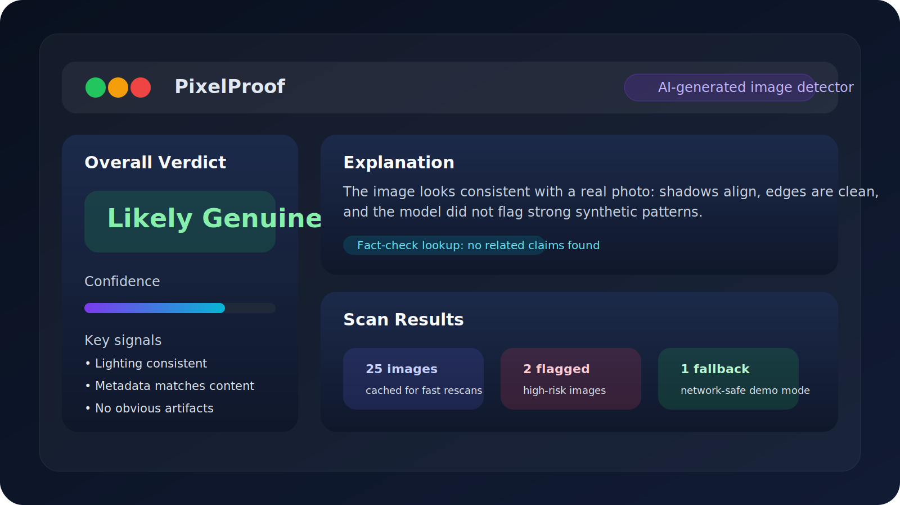
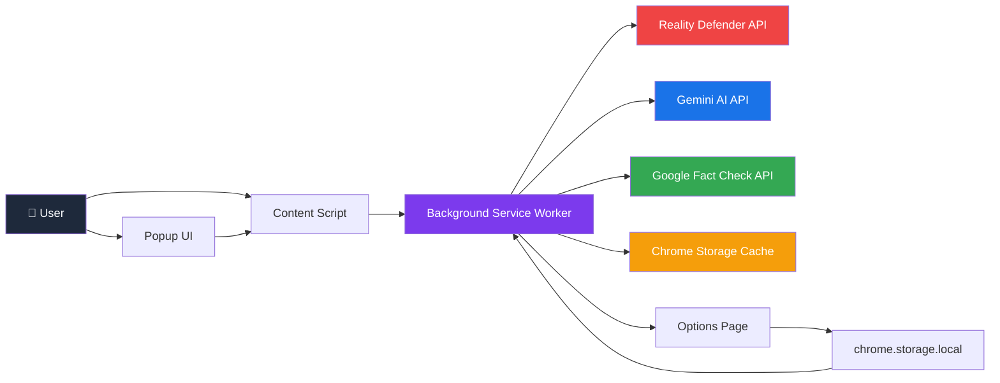
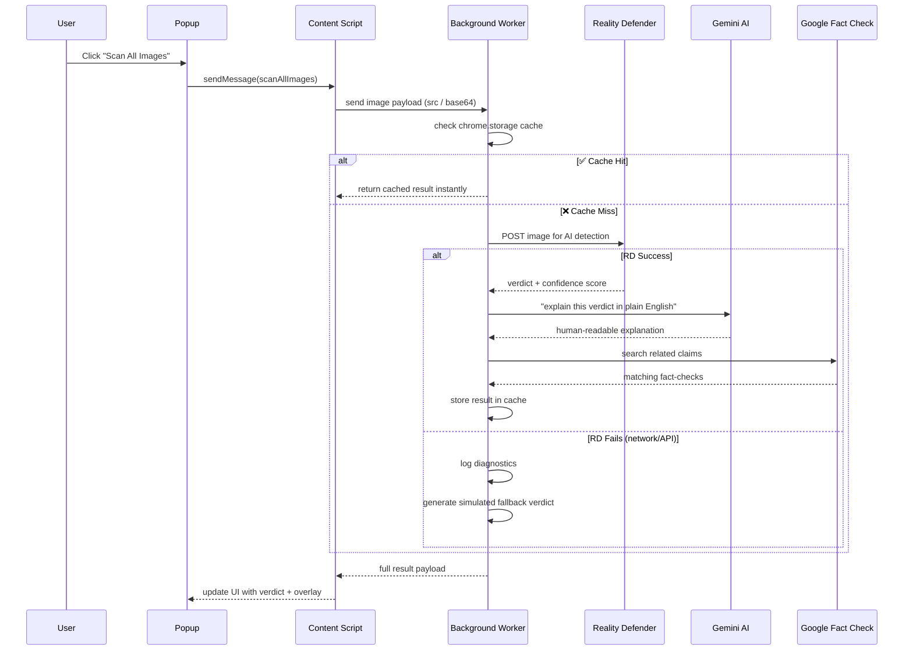
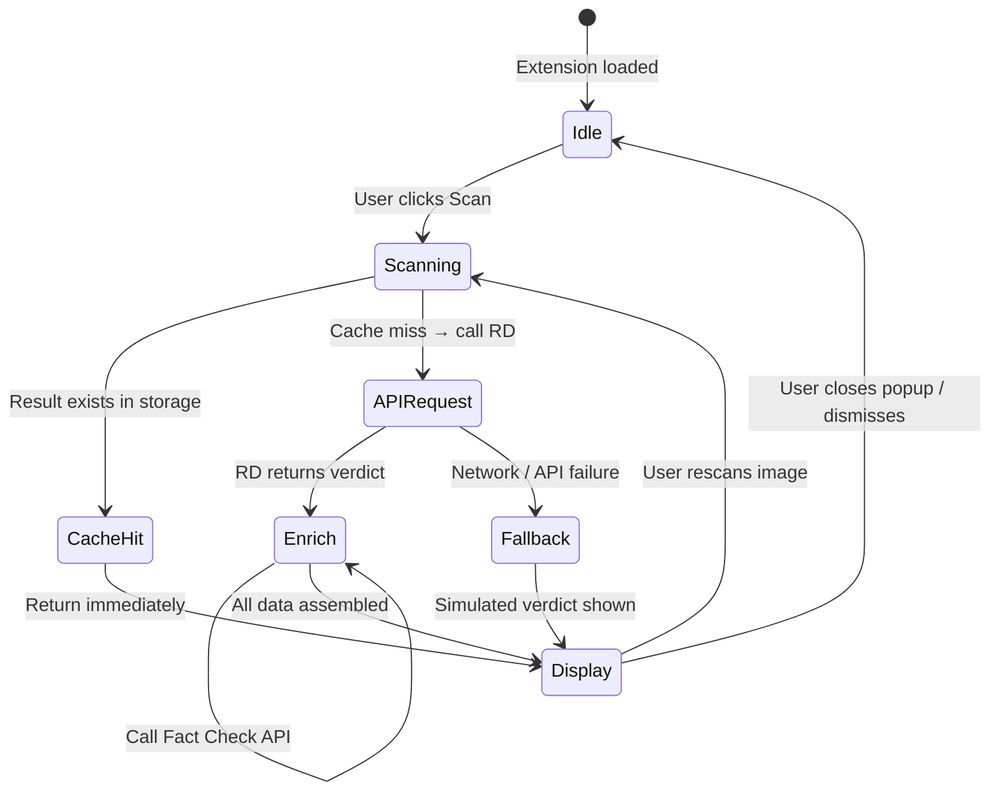
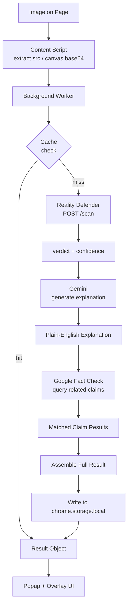

# 🔍 PixelProof — See Through the Lie

<div align="center">



### *A Chrome extension that detects AI-generated & manipulated images in real time — explains them in plain English — and cross-checks claims against live fact-check data.*

<br/>

[](https://developer.chrome.com/docs/extensions/)
[](https://developer.chrome.com/docs/extensions/develop/migrate/what-is-mv3)
[](https://www.realitydefender.com/)
[](https://ai.google.dev/)
[](https://developers.google.com/fact-check)
[](https://devpost.com/)
[](LICENSE)
[](#fallback-mode)
[]()
[]()

</div>

---

## 🌐 The Problem We're Solving

> **The internet is drowning in AI-generated images, deepfakes, and manipulated media — and most people have no way to tell.**

In 2024, AI-generated images spread as "real" news across every platform. Synthetic faces. Fabricated war footage. Deepfaked politicians. The average user has zero tools to fight back in the moment — while scrolling, reading, deciding what to believe.

**PixelProof lives right in your browser. It works on every page. It catches fakes as you scroll.**

---

## ✨ What PixelProof Does

| Feature | Description |
|---|---|
| 🖼️ **Live Image Scanning** | Detects AI-generated or manipulated images on any webpage |
| 🤖 **AI-Powered Explanation** | Gemini explains *why* an image looks suspicious, in plain English |
| 📰 **Fact-Check Lookup** | Cross-references image claims against Google Fact Check database |
| ⚡ **Smart Caching** | Results stored locally — rescans are instant |
| 🛡️ **Graceful Fallback** | Works even when APIs are down — demo never breaks |
| 🔑 **Local Key Storage** | API keys stay on your machine via `chrome.storage.local` |

---

## 🎬 Demo Flow

> *(Works even without live API keys — see Fallback Mode)*

1. **Open any page** with multiple images (news sites work great)
2. **Click the PixelProof extension icon** in Chrome toolbar
3. **Hit `Scan All Images`** — watch overlays appear on each image
4. **Click any flagged image** to see the full verdict + Gemini explanation + fact-check context
5. **Rescan an image** — result appears instantly from cache
6. **Open Settings** — show local API key storage
7. **Clear a key and scan again** — demonstrate graceful fallback mode

---

## 🏗️ Architecture Deep Dive

PixelProof is built on a **4-layer pipeline** inside Chrome's Manifest V3 architecture:

```
User Action → Content Script → Background Worker → External APIs
                                      ↕
                             Chrome Storage Cache
```

### Full System Architecture



### Scan Sequence — Step by Step



### State Machine



### Data Flow



---

## 📁 Project Structure

```
pixelproof/
├── manifest.json               # MV3 manifest — permissions, bg worker, options
├── background.js               # Scan orchestration, caching, tab messaging
├── content.js                  # Image discovery, DOM overlays, per-image UI
├── styles.css                  # Shared content script styles
├── config.example.js           # Local API key template
├── .env.example                # Environment template used by the config generator
│
├── popup/
│   ├── popup.html              # Extension dashboard
│   ├── popup.js                # Scan trigger, results renderer
│   └── popup.css               # Popup styling
│
├── options/
│   ├── options.html            # API key settings page
│   └── options.js              # chrome.storage.local key management

├── panel/
│   ├── panel.html              # Slide-in analysis panel
│   ├── panel.js                # Panel interactions + share/listen actions
│   └── panel.css               # Panel layout and glassmorphism styling
│
├── utils/
│   ├── api.js                  # Reality Defender + Gemini + Fact Check wrappers
│   ├── cache.js                # Storage-backed result cache
│   └── dom.js                  # Image discovery and overlay helpers
│
├── scripts/
│   └── generate_config.js      # .env → config.js for local key injection
│
├── assets/
│   ├── dashboard-preview.svg
│   ├── overlay-preview.svg
│   └── settings-preview.svg

├── docs/
│   ├── imp.md
│   ├── master.md
│   └── prd_extracted.txt

├── icons/
│   ├── icon16.png
│   ├── icon48.png
│   └── icon128.png

├── DEMO_CHECKLIST.md          # Recorder-friendly demo order and notes
├── reference_repo/             # Reference structure from the starter project
├── package.json                # Minimal npm metadata for scripts
│
└── README.md                   # Project overview and setup
```

---

## 🔧 Tech Stack

| Layer | Technology | Purpose |
|---|---|---|
| Extension Platform | Chrome Manifest V3 | Browser-native execution |
| AI Detection | Reality Defender API | Classifies images as real/AI/manipulated |
| Explanation Engine | Google Gemini API | Human-readable verdict explanations |
| Fact Verification | Google Fact Check API | Cross-references flagged claims |
| Storage | chrome.storage.local | Local caching + key storage |
| Messaging | Chrome Extension Messaging | Popup ↔ Content ↔ Background |

---

## ⚙️ Setup & Installation

### 1. Load Extension in Chrome

```bash
# Clone the repo
git clone https://github.com/YOUR_USERNAME/pixelproof.git
```

1. Go to `chrome://extensions`
2. Enable **Developer mode** (top right toggle)
3. Click **Load unpacked** → select the `pixelproof/` folder
4. PixelProof icon appears in your Chrome toolbar ✅

### 2. Add API Keys

**Option A — Options Page (recommended)**
- Click the PixelProof icon → Settings
- Paste keys into the fields → Save
- Keys are stored in `chrome.storage.local` (never sent anywhere)

**Option B — Config Template**
```bash
# Copy .env.example to .env and fill in your keys
# Then generate config.js for the extension runtime
node scripts/generate_config.js
```

**Required keys:**

| Key | Where to get it |
|---|---|
| `REALITY_DEFENDER_API_KEY` | [realitydefender.com](https://www.realitydefender.com/) |
| `GEMINI_API_KEY` | [ai.google.dev](https://ai.google.dev/) |
| `FACT_CHECK_API_KEY` | [Google Cloud Console](https://console.cloud.google.com/) |

### 3. Reload & Go

Reload the extension in `chrome://extensions` after saving keys — then start scanning.

### 4. Demo Prep

- Use `DEMO_CHECKLIST.md` for the exact four-image presentation order.
- For the cleanest recording, keep the demo on a local page with controlled images.
- Use the popup last if you want to show bulk scanning after the individual badge flow.

## Repository Docs

- [Contributing](CONTRIBUTING.md) - how to open clean pull requests and keep changes focused
- [Security](SECURITY.md) - how to report issues safely and handle secrets
- [License](LICENSE) - MIT license for reuse and redistribution

---

## 🛡️ Fallback Mode

PixelProof is **demo-safe by design**. If any API key is missing or a network request fails:

- The extension logs diagnostics to the service worker console
- A **simulated verdict** is generated locally
- The UI continues working — overlays, explanations, confidence scores still display
- The presentation never breaks

**To demo fallback mode:** Open Settings, clear any API key, scan an image. PixelProof handles it gracefully.

---

## 🔒 Security

- Real API keys **never leave your machine** — stored in `chrome.storage.local` only
- `.env` and `config.js` are listed in `.gitignore`
- No key is ever bundled into the extension package or sent to any third party
- If a key is accidentally exposed, rotate it immediately at the provider

---

## 🧪 Testing Checklist

### Core Flow
- [ ] Open a news or social media page with images
- [ ] Scan a single image via the overlay button
- [ ] Scan all images via the popup — verify overlays appear
- [ ] Refresh the page — rescan to confirm cache reuse (instant result)

### Failure Paths
- [ ] Clear API keys in Settings → verify fallback mode activates
- [ ] Disconnect network → verify diagnostics appear in service worker console
- [ ] Try images from cross-origin domains → observe canvas tainting behavior

### Connectivity (PowerShell)
```powershell
Invoke-WebRequest -Uri 'https://www.google.com/generate_204' -UseBasicParsing
Invoke-WebRequest -Uri 'https://api.realitydefender.com/' -UseBasicParsing
```

---

## 🚀 What We Built During the Hackathon

- ✅ **Browser-native image scanning** — works on any page, no page modification required
- ✅ **3-API orchestration pipeline** — Reality Defender → Gemini → Fact Check, in sequence
- ✅ **Intelligent caching layer** — chrome.storage.local backed, deduplicates requests
- ✅ **Safe local key workflow** — zero risk of key exposure via `.env` + `chrome.storage.local`
- ✅ **Graceful fallback mode** — demo works even when APIs are unreachable
- ✅ **Plain-English AI explanations** — Gemini turns raw detection output into something a non-technical user can act on

---

## 💡 Why PixelProof Matters

Misinformation spreads at the speed of a scroll. By the time a fact-checker publishes a correction, millions of people have already seen the fake image and formed an opinion.

PixelProof puts the detection tool **right where the content is** — in the browser, in real time, on every page. It doesn't ask users to copy URLs into some external tool. It works where the harm is already happening.

---

## 📄 License

MIT — see [LICENSE](LICENSE)

---

<div align="center">

**Built for Next Byte Hacks V2** · Made with 🔍 and too much caffeine

*If you're seeing fake images you can't unsee — you're welcome.*

</div>
