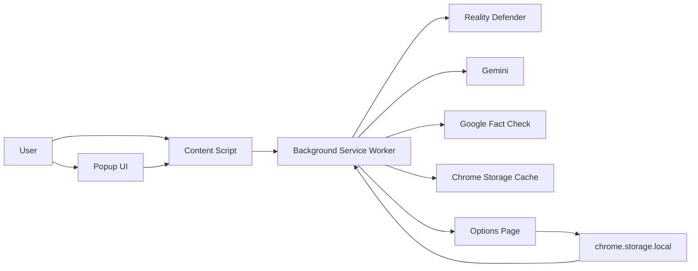
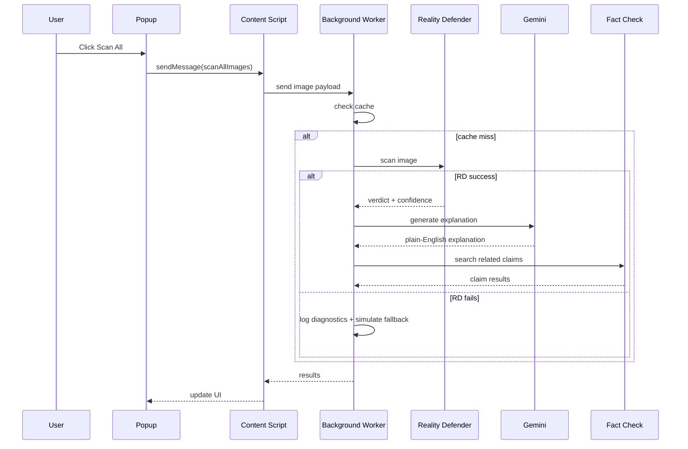
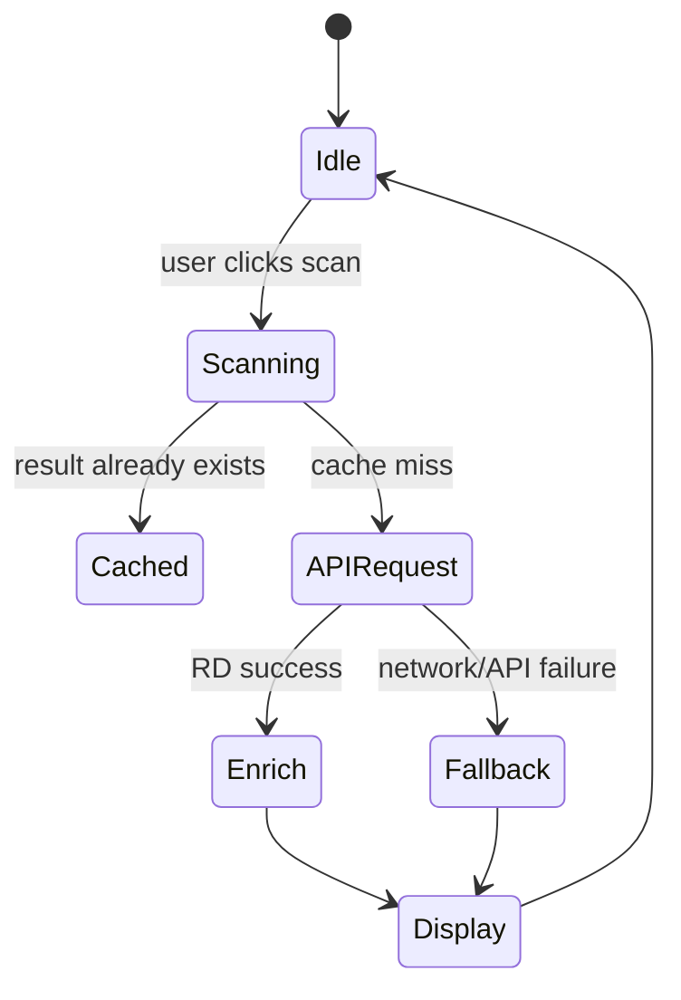

# PixelProof

PixelProof is a Chrome extension hackathon project that scans images on any page, tries to classify whether they are AI-generated or manipulated, explains the result in plain English, and cross-checks likely claims against fact-check data.

It is built to be demo-friendly: if a network API fails, the extension falls back to a simulated verdict so the presentation keeps moving.

## What this project shows
- Browser-native image scanning inside Chrome
- AI-assisted explanation of suspicious visual artifacts
- Fact-check lookup for context and credibility
- Caching and duplicate-request handling
- Safe local-key workflow using `.env` and `chrome.storage.local`
- Graceful fallback when an external API is unavailable

## Hackathon pitch
If a judge asks what PixelProof does, say this:

> PixelProof is a browser extension that helps people spot AI-generated or manipulated images in real time, explains the suspicious parts in simple language, and checks whether related claims have already been fact-checked.

## Demo flow
1. Open a page with multiple images.
2. Click the PixelProof popup.
3. Press `Scan All Images`.
4. Show verdicts, explanations, and the flagged image list.
5. Rescan one image to show caching.
6. Open Settings and save API keys locally.
7. Demonstrate fallback mode by clearing a key and scanning again.

## Architecture



### Scan sequence



### State and data flow



## File map
- [manifest.json](manifest.json) - MV3 manifest, background worker, permissions, options page
- [background.js](background.js) - scan orchestration, caching, tab messaging
- [content.js](content.js) - image discovery, overlays, per-image actions
- [popup/popup.html](popup/popup.html) and [popup/popup.js](popup/popup.js) - dashboard and settings button
- [options/options.html](options/options.html) and [options/options.js](options/options.js) - local API key settings
- [utils/api.js](utils/api.js) - Reality Defender, Gemini, and Fact Check API wrappers
- [utils/cache.js](utils/cache.js) - storage-backed cache
- [scripts/generate_config.js](scripts/generate_config.js) - local `.env` to `config.js` generator

## Setup

### 1. Install
1. Clone the repo.
2. Open `chrome://extensions`.
3. Enable Developer mode.
4. Click Load unpacked and choose this folder.

### 2. Add API keys locally
You can use either workflow:

- **Options page:** open PixelProof Settings and save the keys in `chrome.storage.local`
- **Env file:** copy `.env.example` to `.env`, fill it, then run `node scripts/generate_config.js`

Required keys:
- `REALITY_DEFENDER_API_KEY`
- `GEMINI_API_KEY`
- `FACT_CHECK_API_KEY`

### 3. Reload
Reload the extension in `chrome://extensions` after changing keys.

## Testing checklist

### Basic checks
- Open a site with several images
- Scan one image from the overlay or context menu
- Scan all images from the popup
- Refresh the page and scan again to confirm cache reuse

### Failure-mode checks
- Clear keys in Settings and scan again to verify fallback mode
- Disconnect from the network and verify diagnostics appear in the service worker console
- Try a site with remote images to see whether CORS/canvas tainting affects base64 conversion

### Connectivity checks
Run these in PowerShell if Reality Defender fails:

```powershell
Invoke-WebRequest -Uri 'https://www.google.com/generate_204' -UseBasicParsing
Invoke-WebRequest -Uri 'https://api.realitydefender.com/' -UseBasicParsing
```

If those fail, it is usually network, firewall, DNS, or TLS related rather than an app bug.

## Troubleshooting

### `TypeError: Failed to fetch`
This means the browser could not complete the request. Check:
- your internet connection
- VPN or proxy rules
- firewall restrictions
- whether the API endpoint is reachable from this machine

### No content script response
Reload the extension and make sure the page is not on a restricted Chrome internal page.

### Empty API key behavior
PixelProof intentionally falls back to simulated detection if a key is missing so the demo still works.

## Demo checklist for judges
- Open the popup and show the overall score
- Scan a suspicious image and explain the verdict
- Show the Gemini explanation and fact-check results
- Demonstrate `Scan All Images`
- Show the caching effect by rescanning
- Open the Settings page and show local key storage
- Mention the fallback path for unreliable network conditions

## Security
- Real keys should stay local only
- `.env` and `config.js` are ignored by Git
- Use `options/options.js` or `.env` for local development
- If any key was exposed publicly, rotate it immediately

## Why the project is useful
PixelProof gives judges a clear story:
- problem: misinformation and synthetic media are hard to spot
- solution: a browser-native assistant that flags suspicious images in context
- demo value: easy to show, easy to understand, graceful under API failures

## Next improvements
- Add screenshot support for the README and pitch deck
- Add a backend proxy for image uploads to reduce CORS issues
- Add tests for the API helpers and scan flow
- Add encrypted key storage if you want a stronger local-secret model

## License
MIT

